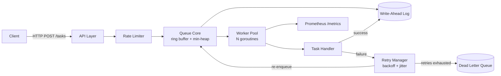

# Plan: Concurrent Task Queue

## Assumptions (flag if wrong)
- **Language: Go.** Production-realistic (Kubernetes, Docker, etcd, CockroachDB are all Go), native concurrency primitives that map directly onto interview questions, and fast enough to build in 2–3 months. Rust would be more impressive but risks the timeline — happy to switch if you'd rather.
- **Scope: single-node.** See Non-Goals in `context.md`.

## Architecture



### Components

1. **API Layer** — HTTP endpoints: submit task, get status, cancel, list DLQ. Rate-limited via token bucket.
2. **Queue Core** — hand-rolled ring buffer (fixed-size array, head/tail indices) for immediate FIFO tasks, with blocking consumer wake-up (channel- or `sync.Cond`-based — see ADR); min-heap for scheduled/delayed tasks, promoted into the ring buffer by a background scheduler goroutine.
3. **Write-Ahead Log** — every state transition (enqueued → started → completed/failed) appended before it's acted on. Hand-rolled, not a third-party embedded DB — this is the piece that proves you understand durability, not just used a library that provides it.
4. **Worker Pool** — fixed N goroutines pulling from the queue; context-cancellation-aware for graceful shutdown.
5. **Retry Manager** — exponential backoff + jitter; after max retries, moves the task to the dead-letter queue.
6. **Backpressure** — bounded queue capacity; configurable policy (reject with 503, or block) when full.
7. **Observability** — Prometheus metrics (queue depth, latency histograms, throughput, worker utilization), structured logs with per-task correlation IDs.

## CS Fundamentals → Production Mapping

This table is the actual answer to "how does this cover CS fundamentals" — point to it directly in interviews.

| Fundamental | Production Concept | Lives In |
|---|---|---|
| Heaps / priority queues | Delayed job scheduling | Scheduler |
| Hash maps | O(1) task lookup, dedup | Task registry, idempotency |
| Ring buffers | Bounded FIFO queue | Queue core |
| OS thread scheduling | Worker concurrency model | Worker pool (goroutines) |
| Mutexes / atomics / CAS | Thread-safe state mutation | Queue core, metrics |
| Condition variables | Blocking/waking idle workers | Worker pool |
| Memory model (happens-before) | Correctness under concurrency | Verified via `go test -race` |
| WAL & crash recovery | Durability, ACID-like guarantees | Persistence layer |
| Log compaction | Bounded disk growth | Persistence layer (snapshotting) |
| Idempotency | At-least-once → effectively-once | Dedup via idempotency keys |
| Backpressure | Load shedding under overload | Bounded queue + reject policy |
| Circuit breaker | Fault isolation | Retry manager |
| Token bucket | Submission rate limiting | API middleware |
| Exponential backoff + jitter | Retry strategy | Retry manager |

## Testing Strategy
- Unit tests per component, table-driven
- `-race` detector mandatory on every concurrency-touching test
- Crash-recovery test: kill the process mid-run, verify WAL replay restores correct state
- Load test (vegeta or k6) for backpressure behavior under sustained overload
- Benchmarks: throughput (tasks/sec) and p50/p99 latency at varying worker counts

## Repo Structure (proposed)
```
/cmd/server          — main entrypoint
/internal/queue      — ring buffer + heap
/internal/worker     — worker pool
/internal/wal        — write-ahead log + snapshot
/internal/retry      — backoff + DLQ
/internal/api        — HTTP handlers, rate limiter
/internal/metrics    — Prometheus instrumentation
/test                — integration + load tests (unit tests live alongside code)
```

## High-Level Phases
See `implementation-plan.md` for the week-by-week breakdown with verification criteria. Summary:
1. Setup & design validation
2. Core queue + concurrency
3. Durability (WAL + recovery)
4. Retry, DLQ, idempotency
5. API + backpressure
6. Observability
7. Polish, docs, benchmarks